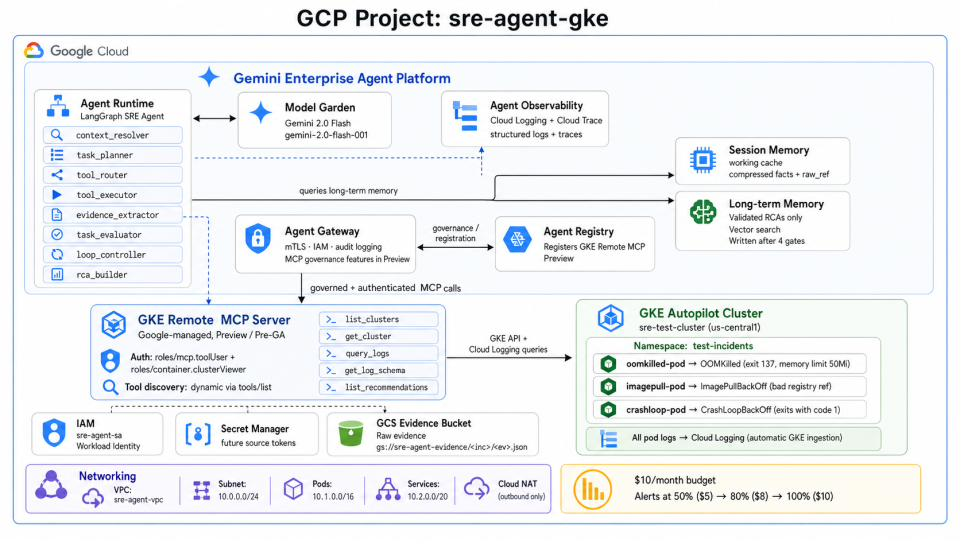

# GCP SRE Agent

An AI-powered Site Reliability Engineering co-pilot that assists SREs with **read-only Kubernetes incident investigation on GCP**.

Given an incident description, the agent collects evidence from GKE through MCP tools, builds a structured root-cause-analysis draft, and writes evidence to GCS.

**The agent does not make production changes. Remediation remains human-approved.**

Built with:

- [LangGraph](https://langchain-ai.github.io/langgraph/)
- [Vertex AI Agent Engine](https://cloud.google.com/vertex-ai/generative-ai/docs/agent-engine/overview)
- [GKE Remote MCP](https://cloud.google.com/kubernetes-engine/docs/how-to/use-gke-mcp) (Google-managed, read-only)
- Custom Cloud Run MCP fallback
- GCS evidence storage
- Cloud Logging / Cloud Trace / Cloud Monitoring
- Terraform (infrastructure)

---

## Current implementation status

```text
Incident query
  → LangGraph SRE Agent (Vertex AI Agent Engine)
  → GKE Remote MCP  (primary)
  → Custom Cloud Run MCP  (fallback if needed)
  → Evidence extraction → GCS evidence archive
  → RCA draft with evidence IDs
```

### Agent Gateway

Agent Gateway (IAM auth + audit logging governance layer) is **not wired in the current implementation**.

All MCP calls go directly to GKE Remote MCP or the Cloud Run fallback via the service account identity. Agent Gateway is a future phase item documented in the ADR.

---

## What this agent does

The agent can:

- read Kubernetes pod status
- read pod events
- read current and previous pod logs
- inspect deployment context
- extract and compress evidence facts
- write sanitized raw evidence to GCS
- produce an RCA draft with evidence ID citations
- log run metadata to Cloud Logging
- emit OpenTelemetry spans to Cloud Trace

The agent must not:

- create, update, or delete Kubernetes resources
- exec into pods
- read Kubernetes secrets
- restart or scale workloads
- perform automatic remediation of any kind

---

## Supported incident types

| Incident           | Example query                             |
| ------------------ | ----------------------------------------- |
| `OOMKilled`        | `"oomkilled-pod keeps getting OOMKilled"` |
| `ImagePullBackOff` | `"imagepull-pod is in ImagePullBackOff"`  |
| `CrashLoopBackOff` | `"crashloop-pod is in CrashLoopBackOff"`  |

---

## Architecture



The agent runs as a LangGraph workflow on Vertex AI Agent Engine:

```text
incident query
  → input_normalizer
  → context_resolver
  → task_planner
  → mcp_router
  → tool_executor
  → evidence_extractor
  → task_evaluator
  → loop_controller  (loops back to task_planner if evidence is insufficient)
  → rca_builder
```

Raw MCP responses are written to GCS. Only compressed facts and evidence IDs flow through LangGraph state.

---

## Deployment modes

| Mode                          | Use case                                    | GKE behaviour                                                    |
| ----------------------------- | ------------------------------------------- | ---------------------------------------------------------------- |
| **Path 1 — Demo cluster**     | Build a clean test environment from scratch | Terraform creates a new GKE Autopilot cluster                    |
| **Path 2 — Existing cluster** | Connect to a cluster you already operate    | Terraform skips GKE creation; you supply cluster values manually |

> **Current Terraform state:** The repo creates a new GCP project and demo GKE cluster by default (Path 1).
> Path 2 (existing cluster) requires the Terraform changes described in [Appendix A](#appendix-a--terraform-changes-for-existing-gke-cluster-mode).

---

## Repository structure

```text
sre-agent-gcp/
├── iac/                          # Terraform — all GCP infrastructure
│   ├── project.tf                # GCP project resource + billing link
│   ├── apis.tf                   # All required API enablement (alphabetical)
│   ├── buckets.tf                # GCS evidence + staging buckets + IAM
│   ├── main.tf                   # Module composition only (networking, iam, gke, cloudrun)
│   ├── monitoring.tf             # Log-based metrics + alert policies
│   ├── outputs.tf                # All terraform output values
│   ├── variables.tf              # Input variables with type + validation
│   ├── versions.tf               # Provider version constraints (Terraform ≥ 1.6)
│   ├── terraform.tfvars.example  # Copy to terraform.tfvars and fill in two values
│   └── modules/
│       ├── networking/           # VPC, subnet, Private Google Access, Cloud NAT
│       ├── iam/                  # Service account + all project IAM roles
│       ├── gke/                  # GKE Autopilot cluster + Workload Identity
│       └── cloudrun/             # Custom MCP server, Artifact Registry, invoker IAM
│
├── agent/                        # LangGraph agent code
│   ├── main.py                   # SREAgent class — Agent Engine entrypoint
│   ├── graph.py                  # LangGraph graph definition (9 nodes)
│   ├── state.py                  # AgentState schema
│   ├── gemini_client.py          # Gemini API wrapper (reads GEMINI_MODEL env var)
│   ├── mcp_client.py             # MCP tool client (GKE Remote + Custom)
│   ├── gcs_client.py             # Evidence writer
│   ├── otel.py                   # OpenTelemetry / Cloud Trace setup
│   ├── prompts.py                # LLM prompt templates
│   ├── requirements.txt          # Python dependencies
│   ├── .env.example              # Reference only — auto-generated by scripts/init-env.sh
│   └── nodes/
│       ├── input_normalizer.py   # Validate and normalise the query
│       ├── context_resolver.py   # Resolve cluster/namespace/pod context
│       ├── task_planner.py       # Plan which MCP tools to call next
│       ├── mcp_router.py         # Choose GKE Remote or Custom MCP
│       ├── tool_executor.py      # Call the selected MCP tool
│       ├── evidence_extractor.py # Extract facts; write raw response to GCS
│       ├── task_evaluator.py     # Score confidence against evidence
│       ├── loop_controller.py    # Continue or exit investigation loop
│       └── rca_builder.py        # Generate final RCA with evidence citations
│
├── mcp/                          # Custom Cloud Run MCP server (fallback)
│   ├── server.py
│   ├── Dockerfile
│   ├── requirements.txt
│   └── tools/
│       ├── pods.py
│       ├── events.py
│       ├── deployments.py
│       └── logs.py
│
├── k8s/                          # Test incident manifests (demo cluster only)
│   ├── namespace.yaml
│   ├── oomkilled-pod.yaml
│   ├── imagepull-pod.yaml
│   └── crashloop-pod.yaml
│
├── scripts/
│   └── init-env.sh               # Auto-generates agent/.env from terraform outputs
│
├── docs/
│   └── architecture.jpeg         # Architecture diagram
│
├── deploy_agent.py               # Deploy LangGraph to Agent Engine
├── invoke_agent.py               # Invoke the deployed Agent Engine agent
└── run.py                        # Run agent locally (no Agent Engine needed)
```

---

## Prerequisites

| Tool                  | Version     | Notes                                                              |
| --------------------- | ----------- | ------------------------------------------------------------------ |
| `gcloud` CLI          | Any current | [Install guide](https://cloud.google.com/sdk/docs/install)         |
| Terraform             | `1.6+`      | [Install guide](https://developer.hashicorp.com/terraform/install) |
| `kubectl`             | Any         | `gcloud components install kubectl`                                |
| Python                | `3.11+`     |                                                                    |
| Docker or Cloud Build | —           | Required for MCP image build                                       |

GCP permissions the operator needs:

- permission to create or use a GCP project
- permission to link billing
- permission to enable APIs
- permission to create IAM service accounts and grant IAM roles
- permission to create GKE, Cloud Run, GCS, Artifact Registry, and Cloud Monitoring resources

For existing cluster mode, the operator also needs permission in the **existing GKE cluster project** to grant read-only IAM (and optionally Kubernetes RBAC) to the SRE Agent service account.

---

---

# Path 1 — Demo cluster mode

Use this path to create a clean GCP project and demo GKE cluster from scratch.

---

## Step 1 — Authenticate to GCP

```bash
gcloud auth login
gcloud auth application-default login
```

Verify:

```bash
gcloud auth list
gcloud config list
```

---

## Step 2 — Clone the repo

```bash
git clone https://github.com/Ashmin77/sre-agent-gcp.git
cd sre-agent-gcp
```

---

## Step 3 — Configure Terraform values

```bash
cp iac/terraform.tfvars.example iac/terraform.tfvars
```

Edit the file and set the two required values:

```hcl
project_id      = "YOUR_GCP_PROJECT_ID"      # globally unique, e.g. "acme-sre-agent"
billing_account = "XXXXXX-XXXXXX-XXXXXX"     # find with: gcloud billing accounts list
region          = "us-central1"              # optional — change if needed
zone            = "us-central1-a"            # optional — must match region
```

All downstream values (bucket names, service account email, Cloud Run URL) are derived from these two required fields by Terraform. The only other manual edit is `AGENT_RESOURCE_NAME`, which you add after the Agent Engine deployment in step 14.

---

## Step 4 — Initialize and validate Terraform

```bash
terraform -chdir=iac init
terraform -chdir=iac validate
terraform -chdir=iac plan
```

---

## Step 5 — Apply base infrastructure

```bash
terraform -chdir=iac apply
```

Terraform creates:

- VPC, subnet, Cloud NAT
- GKE Autopilot cluster (`sre-test-cluster`)
- Service account (`sre-agent-sa`) with least-privilege IAM roles
- Artifact Registry repository for the MCP container image
- Cloud Run MCP service definition (`sre-k8s-mcp`) — activated in step 7 once the image exists
- GCS evidence bucket (`YOUR_GCP_PROJECT_ID-evidence`) — 90-day lifecycle, versioning enabled
- GCS staging bucket (`YOUR_GCP_PROJECT_ID-staging`) — for Agent Engine deployment artifacts
- Log-based metrics and alert policies in Cloud Monitoring

> **If apply fails because the Cloud Run image does not exist:** Terraform creates the Cloud Run service and references the image, but the image has not been built yet. This can cause a first-apply failure. Follow the recovery flow: complete step 6 to build the image, then run `terraform -chdir=iac apply` again.

---

## Step 6 — Build and push the MCP container image

Run after Artifact Registry exists (created in step 5):

```bash
PROJECT_ID=$(terraform -chdir=iac output -raw project_id)

gcloud builds submit ./mcp \
  --tag="us-docker.pkg.dev/${PROJECT_ID}/sre-agent-repo/sre-k8s-mcp:v1" \
  --project="${PROJECT_ID}"
```

---

## Step 7 — Re-apply to activate Cloud Run with the new image

```bash
terraform -chdir=iac apply -target=module.cloudrun
```

Verify the service URL is returned:

```bash
gcloud run services describe sre-k8s-mcp \
  --project="${PROJECT_ID}" \
  --region="$(terraform -chdir=iac output -raw region)" \
  --format="value(status.url)"
```

---

## Step 8 — Generate agent/.env automatically

This script reads every value from `terraform output` and writes `agent/.env`. No manual copy-paste.

```bash
bash scripts/init-env.sh
```

Verify:

```bash
cat agent/.env | grep -E "PROJECT_ID|REGION|GKE|MCP|BUCKET|SERVICE_ACCOUNT|MODEL"
```

`agent/.env` is gitignored. Do not commit it.

---

## Step 9 — Create Python environment and install dependencies

```bash
python3 -m venv .venv
source .venv/bin/activate

pip install --upgrade pip
pip install -r agent/requirements.txt
pip install "cloudpickle==3.0.0"
pip install "google-cloud-aiplatform[agent_engines]>=1.152.0"
pip install "google-genai>=1.0.0"
pip install "opentelemetry-api>=1.28.0" \
            "opentelemetry-sdk>=1.28.0" \
            "opentelemetry-exporter-gcp-trace>=1.8.0"
```

Verify:

```bash
python -c "import vertexai, cloudpickle; print('ok — cloudpickle', cloudpickle.__version__)"
```

> This prototype was validated with `cloudpickle==3.0.0`. Do not change this version unless you retest Agent Engine deployment end-to-end.

---

## Step 10 — Connect kubectl to the demo GKE cluster

```bash
$(terraform -chdir=iac output -raw gke_connect_command)

kubectl get nodes
```

---

## Step 11 — Deploy test incident workloads

```bash
kubectl apply -f k8s/namespace.yaml
kubectl apply -f k8s/oomkilled-pod.yaml
kubectl apply -f k8s/imagepull-pod.yaml
kubectl apply -f k8s/crashloop-pod.yaml
```

Wait approximately 2 minutes, then:

```bash
kubectl get pods -n test-incidents
```

Expected status can vary. `oomkilled-pod` may show `CrashLoopBackOff` while the last termination reason is `OOMKilled`. Confirm the OOMKilled reason:

```bash
kubectl describe pod oomkilled-pod -n test-incidents | grep -A8 "Last State"
# Expected: Reason: OOMKilled  /  Exit Code: 137
```

---

## Step 12 — Test the agent locally

Run the agent directly from your workstation before deploying to Agent Engine:

```bash
python run.py "oomkilled-pod keeps getting OOMKilled" \
  --namespace test-incidents --pod oomkilled-pod --severity critical

python run.py "imagepull-pod is in ImagePullBackOff" \
  --namespace test-incidents --pod imagepull-pod --severity high

python run.py "crashloop-pod is in CrashLoopBackOff" \
  --namespace test-incidents --pod crashloop-pod
```

Successful output includes:

```text
Run ID
Duration
Tool calls
Evidence IDs
GCS evidence path
Confidence band
RCA summary
```

---

## Step 13 — Verify evidence in GCS

```bash
EVIDENCE_BUCKET=$(terraform -chdir=iac output -raw evidence_bucket_name)

gcloud storage ls -l "gs://${EVIDENCE_BUCKET}/**" | tail -20

# Inspect one evidence file — replace <RUN_ID> with the run ID printed above
gcloud storage cat "gs://${EVIDENCE_BUCKET}/<RUN_ID>/ev_001.json"
```

---

## Step 14 — Deploy LangGraph agent to Agent Engine

`agent/.env` already contains `STAGING_BUCKET` and `AGENT_SERVICE_ACCOUNT` from step 8, so no manual exports are needed:

```bash
python deploy_agent.py
```

Expected output:

```text
Deployment complete
Resource: projects/YOUR_PROJECT_NUMBER/locations/us-central1/reasoningEngines/YOUR_ENGINE_ID
```

Copy the full resource name.

---

## Step 15 — Save the Agent Engine resource name

This is the only manual edit after `init-env.sh`. Append the resource name to `agent/.env`:

```bash
echo "AGENT_RESOURCE_NAME=projects/YOUR_PROJECT_NUMBER/locations/us-central1/reasoningEngines/YOUR_ENGINE_ID" >> agent/.env

grep AGENT_RESOURCE_NAME agent/.env
```

Replace the example value with the exact string printed by `deploy_agent.py`.

---

## Step 16 — Invoke the deployed agent

```bash
python invoke_agent.py "oomkilled-pod keeps getting OOMKilled" \
  --namespace test-incidents --pod oomkilled-pod --severity critical

python invoke_agent.py "imagepull-pod is in ImagePullBackOff" \
  --namespace test-incidents --pod imagepull-pod

python invoke_agent.py "crashloop-pod is in CrashLoopBackOff" \
  --namespace test-incidents --pod crashloop-pod
```

---

## Step 17 — Verify structured logs

```bash
PROJECT_ID=$(terraform -chdir=iac output -raw project_id)

gcloud logging read 'jsonPayload.run_id:*' \
  --project="${PROJECT_ID}" \
  --limit=10 \
  --format="table(timestamp,jsonPayload.run_id,jsonPayload.incident_type,jsonPayload.confidence,jsonPayload.status)"
```

---

## Step 18 — Verify Cloud Trace

Open Cloud Trace Explorer:

```text
Google Cloud Console → Trace → Trace Explorer
```

Filter by service name `sre-agent`. Expected spans per investigation:

```text
sre_agent.investigation
  ├── input_normalizer
  ├── context_resolver
  ├── task_planner
  ├── mcp_router
  ├── tool_executor
  ├── evidence_extractor
  ├── task_evaluator
  ├── loop_controller
  └── rca_builder
```

---

---

# Path 2 — Existing GKE cluster mode

Use this path when you already have a GKE cluster and want the agent to investigate it.

> **Prerequisite:** The Terraform changes in [Appendix A](#appendix-a--terraform-changes-for-existing-gke-cluster-mode) must be committed before this path works. The steps below describe what to run; Appendix A describes the code changes required first.

## Existing cluster mode — values you need

```bash
export AGENT_PROJECT_ID="YOUR_GCP_PROJECT_ID"
export EXISTING_GKE_PROJECT_ID="your-existing-cluster-project"
export EXISTING_GKE_CLUSTER="your-cluster-name"
export EXISTING_GKE_LOCATION="us-central1"         # region or zone
export EXISTING_GKE_LOCATION_TYPE="region"          # "region" or "zone"
export TARGET_NAMESPACE="your-target-namespace"
export AGENT_SA="sre-agent-sa@${AGENT_PROJECT_ID}.iam.gserviceaccount.com"
```

For zonal clusters:

```bash
export EXISTING_GKE_LOCATION="us-central1-a"
export EXISTING_GKE_LOCATION_TYPE="zone"
```

---

## Step 1 — Confirm the existing cluster

For regional clusters:

```bash
gcloud container clusters describe "${EXISTING_GKE_CLUSTER}" \
  --region "${EXISTING_GKE_LOCATION}" \
  --project "${EXISTING_GKE_PROJECT_ID}"
```

For zonal clusters:

```bash
gcloud container clusters describe "${EXISTING_GKE_CLUSTER}" \
  --zone "${EXISTING_GKE_LOCATION}" \
  --project "${EXISTING_GKE_PROJECT_ID}"
```

---

## Step 2 — Connect kubectl

For regional clusters:

```bash
gcloud container clusters get-credentials "${EXISTING_GKE_CLUSTER}" \
  --region "${EXISTING_GKE_LOCATION}" \
  --project "${EXISTING_GKE_PROJECT_ID}"
```

For zonal clusters:

```bash
gcloud container clusters get-credentials "${EXISTING_GKE_CLUSTER}" \
  --zone "${EXISTING_GKE_LOCATION}" \
  --project "${EXISTING_GKE_PROJECT_ID}"
```

Verify:

```bash
kubectl get ns
kubectl get ns "${TARGET_NAMESPACE}"
kubectl get pods -n "${TARGET_NAMESPACE}"
```

---

## Step 3 — Grant read-only IAM for GKE Remote MCP

Grant the agent service account read-only GKE access in the existing cluster's project:

```bash
gcloud projects add-iam-policy-binding "${EXISTING_GKE_PROJECT_ID}" \
  --member="serviceAccount:${AGENT_SA}" \
  --role="roles/container.clusterViewer"
```

This allows the agent identity to read GKE cluster metadata and Kubernetes resources through the GKE Remote MCP path.

---

## Step 4 — Grant log read access (if the agent reads Cloud Logging)

```bash
gcloud projects add-iam-policy-binding "${EXISTING_GKE_PROJECT_ID}" \
  --member="serviceAccount:${AGENT_SA}" \
  --role="roles/logging.viewer"
```

---

## Step 5 — Grant metrics read access (if the agent reads Cloud Monitoring)

```bash
gcloud projects add-iam-policy-binding "${EXISTING_GKE_PROJECT_ID}" \
  --member="serviceAccount:${AGENT_SA}" \
  --role="roles/monitoring.viewer"
```

---

## Step 6 — Verify IAM

```bash
gcloud projects get-iam-policy "${EXISTING_GKE_PROJECT_ID}" \
  --flatten="bindings[].members" \
  --filter="bindings.members:${AGENT_SA}" \
  --format="table(bindings.role)"
```

Minimum for Kubernetes-only investigation:

```text
roles/container.clusterViewer
```

Full set if logs and metrics are used:

```text
roles/container.clusterViewer
roles/logging.viewer
roles/monitoring.viewer
```

---

## Step 7 — Kubernetes RBAC for custom Cloud Run MCP fallback

Skip this step if you only use GKE Remote MCP. Apply only if the custom Cloud Run MCP fallback calls the Kubernetes API directly.

Create a namespace-scoped Role and RoleBinding for the agent service account:

```bash
cat > existing-cluster-sre-agent-rbac.yaml <<EOF
apiVersion: rbac.authorization.k8s.io/v1
kind: Role
metadata:
  name: sre-agent-read-only
  namespace: ${TARGET_NAMESPACE}
rules:
  - apiGroups: [""]
    resources:
      - pods
      - pods/log
      - events
      - services
      - configmaps
    verbs: [get, list, watch]
  - apiGroups: ["apps"]
    resources:
      - deployments
      - replicasets
      - statefulsets
      - daemonsets
    verbs: [get, list, watch]
---
apiVersion: rbac.authorization.k8s.io/v1
kind: RoleBinding
metadata:
  name: sre-agent-read-only
  namespace: ${TARGET_NAMESPACE}
subjects:
  - kind: User
    name: ${AGENT_SA}
    apiGroup: rbac.authorization.k8s.io
roleRef:
  kind: Role
  name: sre-agent-read-only
  apiGroup: rbac.authorization.k8s.io
EOF

kubectl apply -f existing-cluster-sre-agent-rbac.yaml
```

Verify read-only access and confirm write access is denied:

```bash
kubectl auth can-i get pods        --as="${AGENT_SA}" -n "${TARGET_NAMESPACE}"   # expect: yes
kubectl auth can-i get pods/log    --as="${AGENT_SA}" -n "${TARGET_NAMESPACE}"   # expect: yes
kubectl auth can-i list events     --as="${AGENT_SA}" -n "${TARGET_NAMESPACE}"   # expect: yes
kubectl auth can-i delete pods     --as="${AGENT_SA}" -n "${TARGET_NAMESPACE}"   # expect: no
```

The final `no` is required. It proves the agent cannot delete pods.

**Do not grant these verbs:** `create`, `update`, `patch`, `delete`, `deletecollection`, `escalate`, `bind`, `impersonate`

**Do not grant access to:** `secrets`, `serviceaccounts/token`, `pods/exec`, `pods/attach`, `pods/portforward`, `nodes/proxy`

---

## Step 8 — Configure Terraform for existing cluster mode

After completing [Appendix A](#appendix-a--terraform-changes-for-existing-gke-cluster-mode), edit `iac/terraform.tfvars`:

```hcl
project_id      = "YOUR_GCP_PROJECT_ID"
billing_account = "XXXXXX-XXXXXX-XXXXXX"
region          = "us-central1"
zone            = "us-central1-a"

create_gke_cluster         = false
existing_gke_project_id    = "your-existing-cluster-project"
existing_gke_cluster       = "your-cluster-name"
existing_gke_location      = "us-central1"
existing_gke_location_type = "region"
existing_gke_namespace     = "your-target-namespace"
```

Apply:

```bash
terraform -chdir=iac init
terraform -chdir=iac validate
terraform -chdir=iac plan
terraform -chdir=iac apply
```

---

## Step 9 — Generate agent/.env

```bash
bash scripts/init-env.sh
```

Verify existing cluster values appear:

```bash
cat agent/.env | grep -E "PROJECT_ID|REGION|GKE|NAMESPACE|MCP|BUCKET|SERVICE_ACCOUNT"
```

---

## Step 10 — Test local agent against existing cluster

```bash
python run.py "Investigate pod YOUR_POD_NAME in namespace ${TARGET_NAMESPACE}" \
  --namespace "${TARGET_NAMESPACE}" \
  --pod "YOUR_POD_NAME" \
  --severity high
```

---

## Step 11 — Deploy to Agent Engine

```bash
python deploy_agent.py
```

Save the resource name:

```bash
echo "AGENT_RESOURCE_NAME=projects/YOUR_PROJECT_NUMBER/locations/YOUR_REGION/reasoningEngines/YOUR_ENGINE_ID" >> agent/.env
grep AGENT_RESOURCE_NAME agent/.env
```

---

## Step 12 — Invoke the deployed agent against the existing cluster

```bash
python invoke_agent.py "Investigate pod YOUR_POD_NAME in namespace ${TARGET_NAMESPACE}" \
  --namespace "${TARGET_NAMESPACE}" \
  --pod "YOUR_POD_NAME" \
  --severity high
```

---

## Step 13 — Verify evidence and logs

```bash
EVIDENCE_BUCKET=$(terraform -chdir=iac output -raw evidence_bucket_name)
gcloud storage ls -l "gs://${EVIDENCE_BUCKET}/**" | tail -20
```

```bash
PROJECT_ID=$(terraform -chdir=iac output -raw project_id)
gcloud logging read 'jsonPayload.run_id:*' \
  --project="${PROJECT_ID}" \
  --limit=10 \
  --format="table(timestamp,jsonPayload.run_id,jsonPayload.incident_type,jsonPayload.confidence,jsonPayload.status)"
```

---

---

# Configuration reference

## `iac/terraform.tfvars`

| Variable          | Required | Description                                                    |
| ----------------- | -------- | -------------------------------------------------------------- |
| `project_id`      | Yes      | GCP project ID for the SRE Agent environment (globally unique) |
| `billing_account` | Yes      | Billing account ID — `gcloud billing accounts list`            |
| `region`          | No       | Default `us-central1`                                          |
| `zone`            | No       | Default `us-central1-a`                                        |

Additional variables for existing cluster mode after [Appendix A](#appendix-a--terraform-changes-for-existing-gke-cluster-mode):

| Variable                     | Required for existing cluster mode | Description                                 |
| ---------------------------- | ---------------------------------- | ------------------------------------------- |
| `create_gke_cluster`         | Yes                                | Set `false` to skip demo cluster creation   |
| `existing_gke_project_id`    | Yes                                | Project containing the existing GKE cluster |
| `existing_gke_cluster`       | Yes                                | Existing GKE cluster name                   |
| `existing_gke_location`      | Yes                                | Region or zone of the existing cluster      |
| `existing_gke_location_type` | Yes                                | `"region"` or `"zone"`                      |
| `existing_gke_namespace`     | Yes                                | Namespace to investigate                    |

---

## `agent/.env`

Generated by `bash scripts/init-env.sh` after `terraform apply`. Do not edit the auto-generated values — re-run `init-env.sh` to refresh them. The one exception is `AGENT_RESOURCE_NAME`, which you append manually after `python deploy_agent.py`.

| Variable                | Source                                                  |
| ----------------------- | ------------------------------------------------------- |
| `PROJECT_ID`            | `terraform output -raw project_id`                      |
| `REGION`                | `terraform output -raw region`                          |
| `GEMINI_MODEL`          | Hard-coded `gemini-2.5-flash`                           |
| `K8S_MCP_URL`           | `terraform output -raw custom_mcp_url`                  |
| `GKE_REMOTE_MCP_URL`    | Fixed: `https://container.googleapis.com/mcp/read-only` |
| `EVIDENCE_BUCKET`       | `terraform output -raw evidence_bucket_name`            |
| `STAGING_BUCKET`        | `terraform output -raw staging_bucket_url`              |
| `AGENT_SERVICE_ACCOUNT` | `terraform output -raw agent_service_account_email`     |
| `AGENT_RESOURCE_NAME`   | Added manually after `python deploy_agent.py`           |

---

## Terraform outputs reference

Run `terraform -chdir=iac output` to see all values. Key outputs:

| Output name                   | Description                                           |
| ----------------------------- | ----------------------------------------------------- |
| `project_id`                  | GCP project ID                                        |
| `agent_service_account_email` | Runtime service account email                         |
| `gke_cluster_name`            | GKE cluster name                                      |
| `gke_connect_command`         | Full `gcloud ... get-credentials` command             |
| `custom_mcp_url`              | Cloud Run MCP server URL                              |
| `mcp_build_command`           | Full `gcloud builds submit` command for the MCP image |
| `evidence_bucket_name`        | Evidence GCS bucket name (no `gs://`)                 |
| `evidence_bucket_url`         | Evidence GCS bucket URL (with `gs://`)                |
| `staging_bucket_name`         | Staging GCS bucket name                               |
| `staging_bucket_url`          | Staging GCS bucket URL (with `gs://`)                 |
| `gke_remote_mcp_url`          | Google-managed GKE Remote MCP endpoint                |
| `summary`                     | Full infrastructure summary block                     |

---

# What Terraform manages

| Resource                                      | Terraform file        |
| --------------------------------------------- | --------------------- |
| GCP project creation + billing link           | `project.tf`          |
| All required APIs                             | `apis.tf`             |
| VPC, subnet, Cloud NAT, Private Google Access | `modules/networking/` |
| Demo GKE Autopilot cluster (Path 1 only)      | `modules/gke/`        |
| Service account + IAM roles                   | `modules/iam/`        |
| Artifact Registry                             | `modules/cloudrun/`   |
| Cloud Run MCP service + invoker IAM           | `modules/cloudrun/`   |
| GCS evidence bucket + lifecycle + IAM         | `buckets.tf`          |
| GCS staging bucket + IAM                      | `buckets.tf`          |
| Log-based metrics                             | `monitoring.tf`       |
| Alert policies                                | `monitoring.tf`       |

# What Terraform does not manage

| Item                              | Why                                                  |
| --------------------------------- | ---------------------------------------------------- |
| MCP container image build         | Build artifact — handled by `gcloud builds submit`   |
| LangGraph Agent Engine deployment | Application packaging — handled by `deploy_agent.py` |
| Test incident workloads           | Runtime manifests — applied by `kubectl apply`       |
| Agent invocation                  | Runtime smoke test                                   |
| Agent Registry commands           | Preview/alpha — validate before automating           |
| GCS evidence files                | Runtime output                                       |

> Terraform support for Vertex AI Reasoning Engine / Agent Engine should be evaluated separately before replacing `deploy_agent.py`. For this prototype, Agent Engine deployment remains script-managed as the validated deployment path.

---

# Updating the MCP server

If you change anything under `mcp/`:

```bash
PROJECT_ID=$(terraform -chdir=iac output -raw project_id)

gcloud builds submit ./mcp \
  --tag="us-docker.pkg.dev/${PROJECT_ID}/sre-agent-repo/sre-k8s-mcp:v1" \
  --project="${PROJECT_ID}"

terraform -chdir=iac apply -target=module.cloudrun
```

---

# Observability

## Structured logs

All runs:

```bash
PROJECT_ID=$(terraform -chdir=iac output -raw project_id)

gcloud logging read 'jsonPayload.run_id:*' \
  --project="${PROJECT_ID}" \
  --limit=20
```

Escalations only:

```bash
gcloud logging read 'jsonPayload.confidence_band="escalate"' \
  --project="${PROJECT_ID}" \
  --limit=20
```

Errors only:

```bash
gcloud logging read 'jsonPayload.status="error"' \
  --project="${PROJECT_ID}" \
  --limit=20
```

## Cloud Monitoring

Terraform creates log-based metrics:

```text
sre_agent/invocations
sre_agent/errors
sre_agent/escalations
```

Alert policies are created without notification channels by default. To wire alerts, add notification channel IDs to `notification_channels` in `iac/monitoring.tf`, then:

```bash
terraform -chdir=iac plan
terraform -chdir=iac apply
```

## Cloud Trace

Open Cloud Trace Explorer → filter by `sre-agent`.

Expected node-level spans per investigation:

```text
sre_agent.investigation
  ├── input_normalizer
  ├── context_resolver
  ├── task_planner
  ├── mcp_router
  ├── tool_executor  (one span per MCP call)
  ├── evidence_extractor
  ├── task_evaluator
  ├── loop_controller
  └── rca_builder
```

---

# Troubleshooting

## `cloudpickle` error during Agent Engine deployment

Use the version validated by this prototype:

```bash
pip install "cloudpickle==3.0.0"
pip freeze | grep cloudpickle
# Expected: cloudpickle==3.0.0
```

## `AGENT_RESOURCE_NAME not set`

```bash
grep AGENT_RESOURCE_NAME agent/.env
```

If missing, append it:

```bash
echo "AGENT_RESOURCE_NAME=projects/YOUR_PROJECT_NUMBER/locations/YOUR_REGION/reasoningEngines/YOUR_ENGINE_ID" >> agent/.env
```

Or list deployed agents to find the resource name:

```bash
gcloud ai reasoning-engines list \
  --region=us-central1 \
  --project="${PROJECT_ID}"
```

## MCP tool returns empty evidence

Check Cloud Run logs:

```bash
PROJECT_ID=$(terraform -chdir=iac output -raw project_id)

gcloud logging read \
  'resource.type="cloud_run_revision" AND resource.labels.service_name="sre-k8s-mcp"' \
  --project="${PROJECT_ID}" \
  --limit=50
```

Check GKE access:

```bash
kubectl get pods -n <NAMESPACE>
kubectl get events -n <NAMESPACE> --sort-by='.lastTimestamp'
```

## GKE Remote MCP tool-name errors

Do not use `mcp_gke_*` prefixed names. Known valid tool names:

```text
list_k8s_events
describe_k8s_resource
get_k8s_resource
```

Known constraint: `list_k8s_api_resources` does not accept a `namespace` parameter.

## Existing cluster: permission denied

Check IAM:

```bash
gcloud projects get-iam-policy "${EXISTING_GKE_PROJECT_ID}" \
  --flatten="bindings[].members" \
  --filter="bindings.members:${AGENT_SA}" \
  --format="table(bindings.role)"
```

Check Kubernetes RBAC if using the custom MCP fallback:

```bash
kubectl auth can-i get pods  --as="${AGENT_SA}" -n "${TARGET_NAMESPACE}"   # expect: yes
kubectl auth can-i delete pods --as="${AGENT_SA}" -n "${TARGET_NAMESPACE}" # expect: no
```

## Terraform apply fails on billing

```bash
gcloud billing accounts list
```

The operator needs `roles/billing.user` or `roles/billing.admin` to link a project to billing.

---

# End-to-end smoke test

Run after deployment to confirm all layers are working:

```bash
# 1. Confirm Terraform outputs
terraform -chdir=iac output

# 2. Confirm environment file
cat agent/.env | grep -E "PROJECT_ID|REGION|GKE|MCP|BUCKET|AGENT_RESOURCE_NAME"

# 3. Confirm cluster connection
$(terraform -chdir=iac output -raw gke_connect_command)
kubectl get pods -n test-incidents

# 4. Run local test
python run.py "oomkilled-pod keeps getting OOMKilled" \
  --namespace test-incidents --pod oomkilled-pod --severity critical

# 5. Invoke deployed agent
python invoke_agent.py "oomkilled-pod keeps getting OOMKilled" \
  --namespace test-incidents --pod oomkilled-pod --severity critical

# 6. Confirm evidence
EVIDENCE_BUCKET=$(terraform -chdir=iac output -raw evidence_bucket_name)
gcloud storage ls -l "gs://${EVIDENCE_BUCKET}/**" | tail -20

# 7. Confirm structured logs
PROJECT_ID=$(terraform -chdir=iac output -raw project_id)
gcloud logging read 'jsonPayload.run_id:*' \
  --project="${PROJECT_ID}" \
  --limit=10 \
  --format="table(timestamp,jsonPayload.run_id,jsonPayload.incident_type,jsonPayload.confidence,jsonPayload.status)"
```

---

# Appendix A — Terraform changes for existing GKE cluster mode

These changes are **not yet committed** to the repo. They are required before Path 2 works.

### 1. Add variables to `iac/variables.tf`

```hcl
variable "create_gke_cluster" {
  description = "Whether Terraform should create a new demo GKE cluster. Set false to use an existing cluster."
  type        = bool
  default     = true
}

variable "existing_gke_project_id" {
  description = "Existing GKE cluster project ID. Only used when create_gke_cluster = false."
  type        = string
  default     = null
}

variable "existing_gke_cluster" {
  description = "Existing GKE cluster name. Only used when create_gke_cluster = false."
  type        = string
  default     = null
}

variable "existing_gke_location" {
  description = "Existing GKE cluster region or zone. Only used when create_gke_cluster = false."
  type        = string
  default     = null
}

variable "existing_gke_location_type" {
  description = "Whether existing_gke_location is a region or zone."
  type        = string
  default     = "region"

  validation {
    condition     = contains(["region", "zone"], var.existing_gke_location_type)
    error_message = "existing_gke_location_type must be region or zone."
  }
}

variable "existing_gke_namespace" {
  description = "Target namespace for existing GKE investigations."
  type        = string
  default     = "default"
}
```

### 2. Make GKE module conditional in `iac/main.tf`

```hcl
module "gke" {
  count = var.create_gke_cluster ? 1 : 0

  source             = "./modules/gke"
  project_id         = var.project_id
  region             = var.region
  network_id         = module.networking.network_id
  subnetwork_id      = module.networking.subnetwork_id
  sre_agent_sa_email = module.iam.sre_agent_sa_email
  sre_agent_sa_name  = module.iam.sre_agent_sa_name
}
```

### 3. Update `iac/outputs.tf` to support both modes

Add these locals and outputs:

```hcl
locals {
  effective_gke_project_id = var.create_gke_cluster ? var.project_id : var.existing_gke_project_id
  effective_gke_cluster    = var.create_gke_cluster ? module.gke[0].cluster_name : var.existing_gke_cluster
  effective_gke_location   = var.create_gke_cluster ? module.gke[0].cluster_location : var.existing_gke_location
  effective_gke_namespace  = var.create_gke_cluster ? "test-incidents" : var.existing_gke_namespace
}

output "gke_project_id" {
  description = "Project containing the target GKE cluster."
  value       = local.effective_gke_project_id
}

output "gke_cluster_name" {
  description = "Target GKE cluster name."
  value       = local.effective_gke_cluster
}

output "gke_location" {
  description = "Region or zone of the target GKE cluster."
  value       = local.effective_gke_location
}

output "gke_namespace" {
  description = "Target investigation namespace."
  value       = local.effective_gke_namespace
}

output "gke_connect_command" {
  description = "kubectl authentication command for the target cluster."
  value = (var.create_gke_cluster || var.existing_gke_location_type == "region") ?
    "gcloud container clusters get-credentials ${local.effective_gke_cluster} --region ${local.effective_gke_location} --project ${local.effective_gke_project_id}" :
    "gcloud container clusters get-credentials ${local.effective_gke_cluster} --zone ${local.effective_gke_location} --project ${local.effective_gke_project_id}"
}
```

### 4. Optional — Cross-project IAM managed by Terraform

Only use this if the Terraform runner has IAM admin permissions in the existing cluster project. Otherwise use the manual `gcloud` commands in Path 2, steps 3–5.

```hcl
resource "google_project_iam_member" "agent_existing_gke_viewer" {
  count   = var.create_gke_cluster ? 0 : 1
  project = var.existing_gke_project_id
  role    = "roles/container.clusterViewer"
  member  = "serviceAccount:${module.iam.sre_agent_sa_email}"
}

resource "google_project_iam_member" "agent_existing_logging_viewer" {
  count   = var.create_gke_cluster ? 0 : 1
  project = var.existing_gke_project_id
  role    = "roles/logging.viewer"
  member  = "serviceAccount:${module.iam.sre_agent_sa_email}"
}

resource "google_project_iam_member" "agent_existing_monitoring_viewer" {
  count   = var.create_gke_cluster ? 0 : 1
  project = var.existing_gke_project_id
  role    = "roles/monitoring.viewer"
  member  = "serviceAccount:${module.iam.sre_agent_sa_email}"
}
```

---

# Appendix B — Required safety checks before production cluster use

Before pointing the agent at a production cluster:

```text
[ ] Start with one non-production namespace first.
[ ] Confirm sre-agent-sa has read-only IAM only (no write roles).
[ ] Confirm Kubernetes RBAC denies delete, update, patch, create.
[ ] Confirm the agent cannot read Kubernetes secrets.
[ ] Confirm the agent cannot exec into pods.
[ ] Confirm evidence is written to the correct GCS bucket.
[ ] Confirm logs do not contain sensitive values before LLM calls.
[ ] Confirm every RCA output cites evidence IDs.
[ ] Confirm confidence threshold and human-review escalation path.
[ ] Confirm Cloud Logging, Monitoring, and Trace are working.
```

Minimum permission posture:

```text
Read-only
Namespace-scoped where possible
No secrets access
No pod exec
No write verbs
No automatic remediation
```

---

# Appendix C — Beginner deployment checklist

```text
[ ] Authenticated to GCP.
[ ] Cloned repo.
[ ] Chose Path 1 (demo cluster) or Path 2 (existing cluster).
[ ] Configured iac/terraform.tfvars.
[ ] Ran terraform init / validate / plan / apply.
[ ] Built and pushed MCP image.
[ ] Re-applied Cloud Run module if needed.
[ ] Generated agent/.env with init-env.sh.
[ ] Created Python venv and installed dependencies.
[ ] Verified cloudpickle==3.0.0.
[ ] Connected kubectl.
[ ] Confirmed pods/events/logs are readable.
[ ] Ran local agent test with run.py.
[ ] Confirmed GCS evidence written.
[ ] Deployed to Agent Engine with deploy_agent.py.
[ ] Saved AGENT_RESOURCE_NAME to agent/.env.
[ ] Invoked deployed agent with invoke_agent.py.
[ ] Confirmed evidence / structured logs / Cloud Trace spans.
[ ] Documented pass/fail results.
```
